# BookAByte

Restaurant reservation web application built with Java, Spring Boot, Spring Data JPA, and Thymeleaf.

<p align="center">
  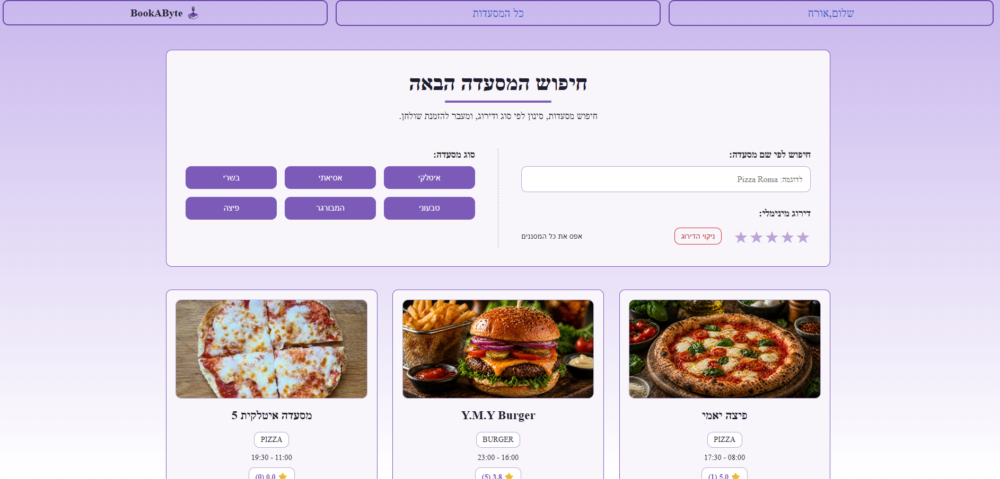
</p>

## Overview

BookAByte is a restaurant reservation web application supporting both customer and administrator workflows.

Customers can browse and filter restaurants, check reservation availability, create and cancel reservations, view upcoming and past reservations, and submit reviews.

Administrators can create and manage restaurants, upload restaurant images, review customer feedback, and view reservation and rating statistics.

The application follows a layered Spring Boot architecture using controllers, services, repositories, and JPA entities.

## Key Features

### Customer

- User registration and login
- Browse and filter restaurants by name, type, and rating
- View restaurant details, reviews, and reservation availability
- Create and cancel reservations
- View upcoming reservations and reservation history
- Submit reviews and ratings after reservations

### Administrator

- Create, update, and manage restaurants
- Upload restaurant images
- View customer reviews
- View reservation and rating statistics

### Restaurant Discovery

<p align="center">
  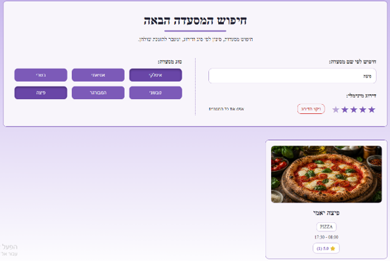
</p>

## Technical Highlights

- Layered Spring Boot architecture with controllers, services, repositories, and JPA entities
- Spring Data JPA and Hibernate for persistence and database access
- Session-based authentication with separate Customer and Administrator roles
- BCrypt password hashing for stored user credentials
- Reservation validation based on restaurant capacity, opening hours, and overlapping reservations
- Transactional reservation creation with pessimistic database locking
- Unit and integration testing, including concurrent reservation testing

## Tech Stack

- Java 17
- Spring Boot
- Spring Web
- Spring Data JPA
- Hibernate / JPA
- H2 Database
- Thymeleaf
- Maven
- JavaScript
- HTML / CSS
- JUnit 5
- Mockito

## Architecture

BookAByte follows a layered application structure:

```text
Web / Thymeleaf UI
        ↓
   Controllers
        ↓
     Services
        ↓
   Repositories
        ↓
   JPA / Hibernate
        ↓
     H2 Database
```

Controllers handle incoming application requests, services contain the business logic, and repositories provide database access through Spring Data JPA.

## Reservation Concurrency

Reservation creation is handled transactionally to prevent concurrent requests from overbooking a restaurant.

When a reservation is created, the application acquires a pessimistic write lock on the relevant restaurant record before evaluating the remaining capacity.

This prevents two concurrent requests from independently reading the same available capacity and both successfully reserving it.

The project also includes an integration test that executes concurrent reservation attempts against limited remaining capacity and verifies that only the valid reservation succeeds.

## Data Model

BookAByte is centered around four main JPA entities:

- `User`
- `Restaurant`
- `Reservation`
- `Review`

Reservations connect customers with restaurants, while reviews associate customer feedback with restaurant reservations.

<p align="center">
  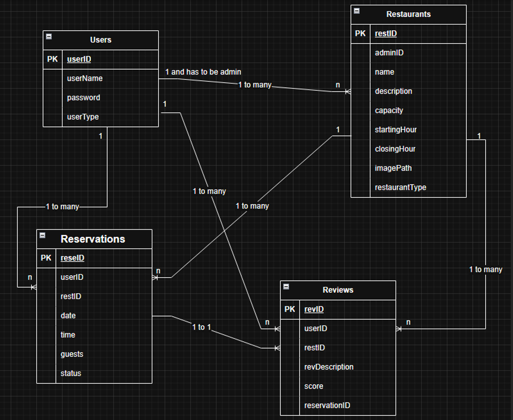
</p>

## Application Screenshots

### Registration

<p align="center">
  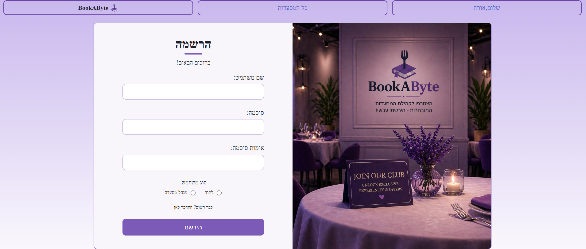
</p>

### Reservation Flow

<p align="center">
  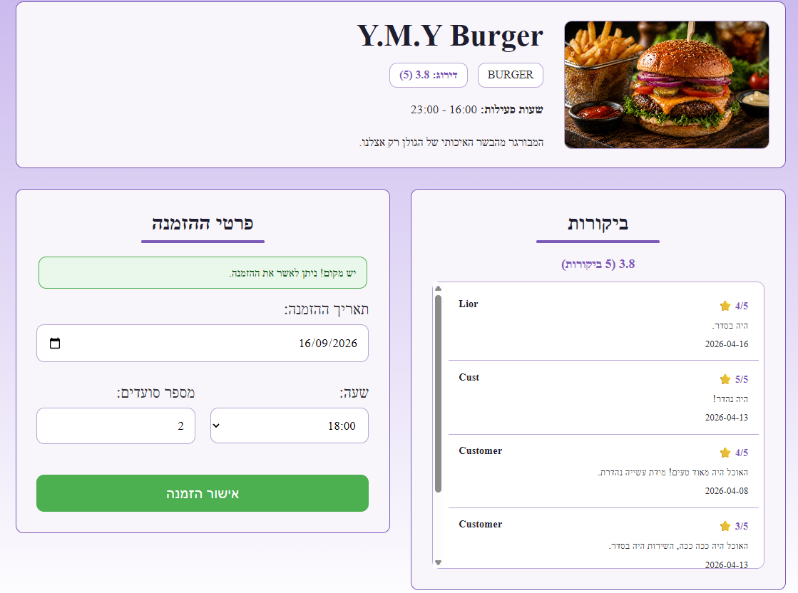
</p>

### Customer Reservations

#### Upcoming Reservations

<p align="center">
  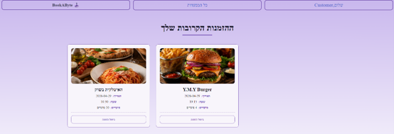
</p>

#### Reservation History

<p align="center">
  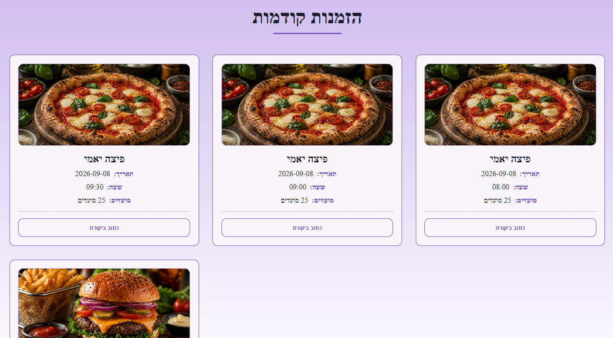
</p>

### Reviews

<p align="center">
  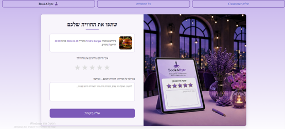
</p>

### Administrator Management

#### Restaurant Management

<p align="center">
  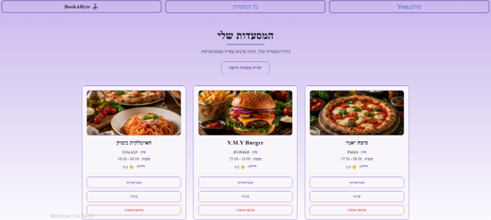
</p>

#### Create Restaurant

<p align="center">
  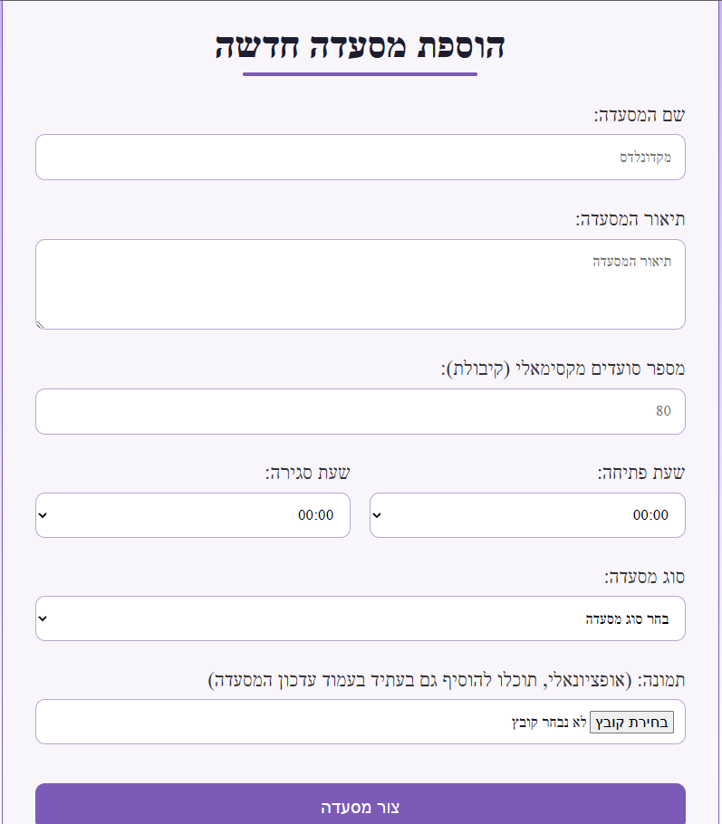
</p>

### Statistics

<p align="center">
  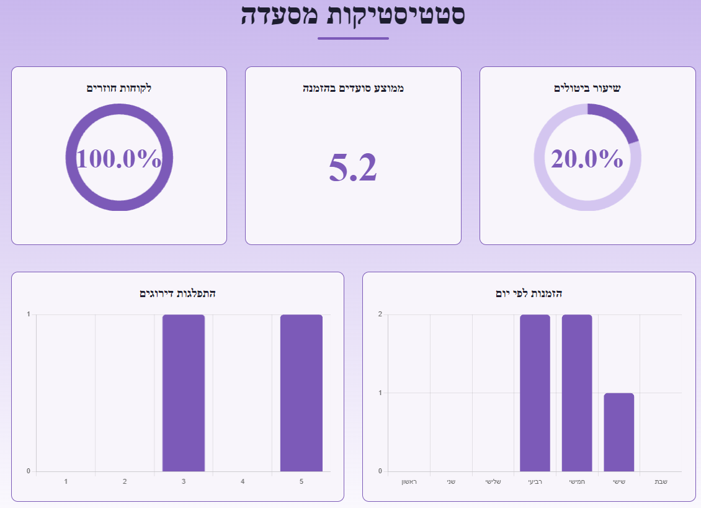
</p>

<p align="center">
  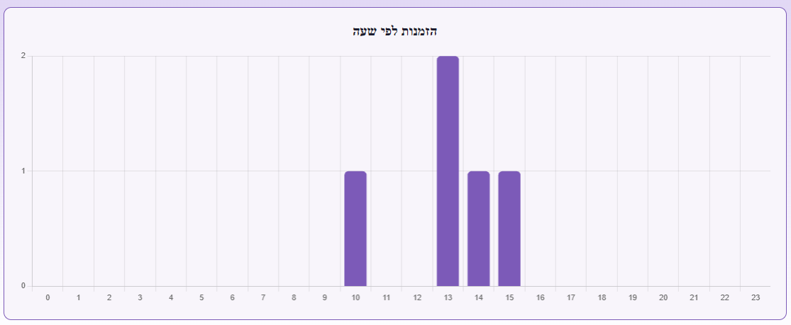
</p>

## How to Run

### Prerequisites

- Java 17
- Git

Maven does not need to be installed separately because the project includes the Maven Wrapper.

### 1. Clone the repository

```bash
git clone https://github.com/GendlerYoni/BookAByte.git
cd BookAByte
```

### 2. Run the application

#### Windows

```powershell
.\mvnw.cmd spring-boot:run
```

#### macOS / Linux

```bash
./mvnw spring-boot:run
```

### 3. Open the application

Once the application starts, open:

```text
http://localhost:8080
```

The application uses a local H2 file database. On the first run, the database is created automatically under the local `data/` directory, which is excluded from Git.

### Quick Demo Flow

1. Register an Administrator account and create a restaurant.
2. Log out and register a Customer account.
3. Browse the available restaurants and create a reservation.
4. Explore upcoming reservations, reservation history, reviews, and administrator statistics.

## Project Context

BookAByte was originally developed as a university software project.

The current repository includes additional cleanup, testing, concurrency handling, and documentation while preserving the original application scope.

The project demonstrates Java and Spring backend development, database-backed business logic, layered application design, testing, and concurrent request handling.

## Contact

**Yoni Gendler**

- 💼 [LinkedIn](https://www.linkedin.com/in/yoni-gendler/)
- 💻 [GitHub](https://github.com/GendlerYoni)
- 📧 [gendler.yoni.dev@gmail.com](mailto:gendler.yoni.dev@gmail.com)
